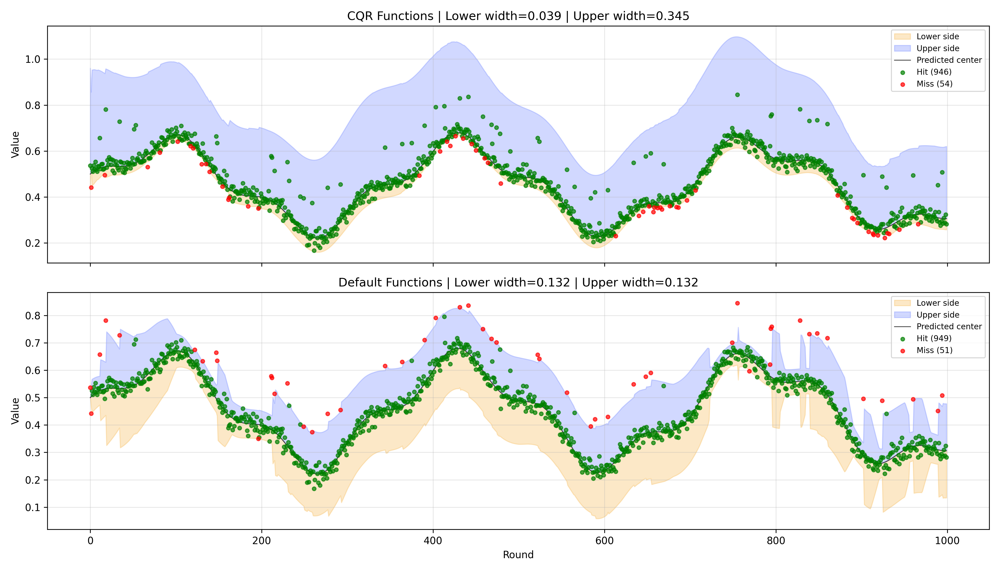
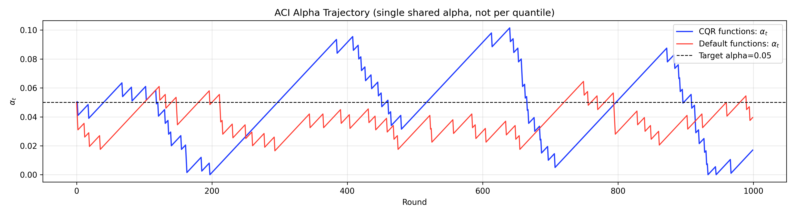

# adaptive-conformal-inference

`adaptive-conformal-inference` is a Python library for **Adaptive Conformal Inference (ACI)**.

Its main job is to provide a clean, model-agnostic **online ACI object** (`ACI`) that:
- takes point predictions,
- issues conformal intervals, and
- updates adaptively from feedback (`y_true`).

This repository also contains example scripts to:
- reproduce figures from the original ACI paper, and
- demonstrate ACI behavior versus a fixed conformal baseline.

Implementation is based on:

> Isaac Gibbs and Emmanuel J. Cand&egrave;s. *Adaptive Conformal Inference Under Distribution Shift.* NeurIPS 2021.
> [arXiv:2106.00170](https://arxiv.org/abs/2106.00170)

ACI adapts conformal prediction sets to distribution shift by tracking a single parameter that adjusts the quantile level online, provably achieving target coverage over long time intervals.

## Installation

```bash
pip install adaptive-conformal-inference
```

For running the example scripts (stock data + plots):

```bash
pip install adaptive-conformal-inference[examples]
```

## Core Usage

### Initialization Parameters

| Parameter | Default | What it controls and how to tune it |
|---|---|---|
| `alpha` | required | Target miss rate. `alpha=0.1` means target coverage is about `90%`. Lower `alpha` makes intervals more conservative (wider on average). |
| `gamma` | required | Adaptation speed for `alpha_t`. Increase if environment changes quickly and coverage lags. Decrease if `alpha_t` oscillates too much. |
| `lookback` | `500` | Calibration memory for score quantiles. Larger is more stable but slower to react. Smaller reacts faster but can be noisy. |
| `method` | `"simple"` | Alpha update rule. `"simple"` reacts directly to each miss/hit. `"momentum"` smooths updates using recent history. |
| `momentum_bw` | `0.95` | Used only for `method="momentum"`. Closer to `1.0` means smoother, longer memory. Lower values emphasize very recent rounds. |
| `score_fn` | `None` | Conformity score function `score_fn(y_true, y_pred) -> float`. Default is absolute error `abs(y_true - y_pred)`. Choose this to match your task's notion of error. |
| `set_fn` | `None` | Prediction-set builder `set_fn(y_pred, qhat)`. Default is symmetric interval `[y_pred-qhat, y_pred+qhat]`. Use this for CQR/relative/non-additive set construction. |
| `clip_alpha` | `True` | Keeps `alpha_t` in `[0, 1]`. Recommended `True` for most users to avoid invalid quantile levels. |

### Conformity Score (`score_fn`)

`score_fn` defines what "bad prediction" means for your problem. ACI adapts coverage for that score.

- Default (`None`): absolute error, good for many regression tasks.
- Relative/percentage error:
  - useful when prediction scale changes a lot over time.
  - often better for volatility-like tasks.
- Asymmetric score:
  - useful if underprediction is more costly than overprediction (or vice versa).

`score_fn` must return a finite number. (Some valid scores, such as CQR score, can be negative inside the base quantile band.)

Built-in helpers (paper-style workflows):

- Scores:
  - `absolute_error_score`
  - `relative_error_score`
  - `cqr_score`
- Set builders:
  - `symmetric_interval_set`
  - `relative_interval_set`
  - `cqr_interval_set`

Example (CQR-style):

```python
from aci import ACI, cqr_score, cqr_interval_set

aci = ACI(
    alpha=0.1,
    gamma=0.005,
    lookback=500,
    score_fn=cqr_score,
    set_fn=cqr_interval_set,
)

# y_pred_t is (q_low_t, q_high_t)
prediction_set = aci.issue(y_pred_t)
out = aci.observe(y_true_t)
```

### Tuning Guide

- Coverage below target for long periods:
  - increase `gamma` (faster correction), or decrease `lookback` (faster calibration updates).
- Coverage far above target (intervals too wide):
  - decrease `gamma`, or increase `lookback` for less reactive widening.
- `alpha_t` is very jumpy:
  - decrease `gamma`, or use `method="momentum"` with high `momentum_bw` (for example `0.95` to `0.99`).
- Regime changes happen often:
  - use smaller `lookback` and/or larger `gamma`.
- Regime is mostly stable:
  - use larger `lookback` and smaller `gamma` for smoother intervals.


### API Reference

The package exposes one class: `aci.ACI`.

| Method / Property | What it does in practice |
|---|---|
| `issue(y_pred)` | Call this once per round after producing your model prediction. Returns `set_fn(y_pred, qhat_t)`. With default `set_fn`, this is `(lower, upper)`. |
| `observe(y_true)` | Call this once the true outcome is available. Computes conformity score and miscoverage event, updates `alpha_t`, and returns diagnostics (`hit`, `err_t`, `score_t`, `alpha_used`, `alpha_next`, `qhat_t`). |
| `reset()` | Restarts the object to its initial state (`alpha_t=alpha`, empty histories). Useful between datasets/episodes. |
| `alpha_t` | Current adaptive miss-rate level that will be used for the next `issue(...)`. If it goes down, intervals usually widen; if it goes up, intervals usually narrow. |
| `alpha_history` | Historical `alpha_t` values. Use this to inspect adaptation behavior and tune `gamma`/`lookback`. |
| `err_history` | Historical miss indicators (`1=miss`, `0=hit`). Use mean of this to estimate realized miss rate. |
| `score_history` | Historical conformity scores from your `score_fn`. Useful for debugging whether score design matches your task. |
| `has_pending_prediction` | `True` after `issue(...)` and before `observe(...)`. Helps enforce correct online call order. |

`err_t` follows the paper directly: `err_t = 1` when `score_t > qhat_t`, else `0`.

### Online Workflow

Use this order every round:

1. Compute your point prediction `y_pred`.
2. Call `issue(y_pred)` to get interval bounds.
3. Observe the true value `y_true`.
4. Call `observe(y_true)` to update ACI state.


```python
from aci import ACI

# One object handles interval issuance + online alpha adaptation
aci = ACI(alpha=0.1, gamma=0.005, lookback=500, method="simple")

for t in range(T):
    y_pred_t = model_predict(x_t)      # your forecaster
    lower, upper = aci.issue(y_pred_t) # C_hat_t(alpha_t)

    y_true_t = observe_truth()
    out = aci.observe(y_true_t)        # updates alpha_t online

    hit = out["hit"]                   # per-round coverage signal
    alpha_next = aci.alpha_t           # alpha to be used on the NEXT round
```


## Reproduce Paper Results

```bash
# Figure 1: Volatility prediction with normalized score (4 stocks)
python examples/figure1/reproduce.py

# Figure 2: Volatility prediction with unnormalized score (4 stocks)
python examples/figure2/reproduce.py
```

### Reproduction File Map

- `examples/figure1/reproduce.py`
  Runs the full Figure 1 reproduction (normalized score), loads stock data, computes local coverage, and renders `figures/figure1.png`.
- `examples/figure2/reproduce.py`
  Runs the full Figure 2 reproduction (unnormalized score), loads stock data, computes local coverage, and renders `figures/figure2.png`.
- `examples/common/data.py`
  Shared data utilities: stock download (`fetch_stock_data`) and local coverage computation (`local_coverage`).
- `examples/common/garch_forecaster.py`
  Shared forecasting logic: rolling GARCH(1,1) fitting and one-step variance predictions.
- `examples/common/aci_workflow.py`
  Shared ACI evaluation loop: runs adaptive ACI vs fixed-alpha baseline on aligned `(y_pred, y_true)` sequences.
- `examples/common/volatility_pipeline.py`
  Shared end-to-end pipeline that combines GARCH forecasts with the ACI workflow; used by both figure scripts.


### Figure 1 (Normalized Score)

| Our reproduction | Paper figure |
|---|---|
|  |  |

### Figure 2 (Unnormalized Score)

| Our reproduction | Paper figure |
|---|---|
|  |  |

## Examples

### 1) Simple Example (Default ACI)

Run:

```bash
python examples/simple_example.py
```

What this example does:
- Uses default ACI score/set functions (absolute-error score + symmetric interval).
- Compares adaptive ACI against a fixed-alpha baseline.
- Visualizes per-round hits (green) and misses (red).

What to observe:
- ACI and fixed both recalibrate with recent scores, but only ACI updates `alpha_t`.
- When misses become frequent, ACI tends to lower `alpha_t` and widen intervals.
- When misses are rare, ACI tends to raise `alpha_t` and narrow intervals.


### 2) CQR Asymmetric Example

Run:

```bash
python examples/cqr_asymmetric_example.py
```

What this example does:
- Demonstrates custom ACI functions using:
  - `cqr_score`
  - `cqr_interval_set`
- Compares:
  - ACI with CQR functions (asymmetric interval behavior)
  - ACI with default functions (symmetric interval behavior)

What to observe:
- With CQR functions, lower and upper sides can have different widths (asymmetric intervals).
- With default functions, intervals remain symmetric around a single center prediction.
- ACI still uses a single shared `alpha_t` for interval coverage in both cases.




## Citation

```bibtex
  @article{gibbs2021adaptive,
    title={Adaptive conformal inference under distribution shift},
    author={Gibbs, Isaac and Candes, Emmanuel},
    journal={Advances in Neural Information Processing Systems},
    volume={34},
    pages={1660--1672},
    year={2021}
  }
```
